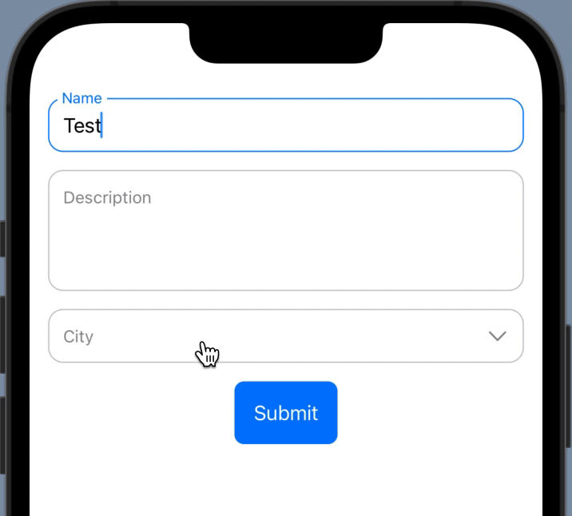

# FloatingInputField (SwiftUI)

`FloatingInputField` is a custom SwiftUI form component that mimics the Android Material-style floating label behavior. It supports single-line, multi-line, and dropdown inputs with animated label transitions, validation messages, and flexible styling.

## ✨ Features

- ✅ Floating placeholder label that animates on focus or input
- ✅ Supports:
  - `singleLine` input (`TextField`)
  - `multiLine` input (`TextEditor`)
  - `dropdown` input using SwiftUI `Menu`
- ✅ Optional validation/error message below the field
- ✅ Clean, reusable, and configurable design
- ✅ Works seamlessly in dynamic forms with multiple inputs
- 
## 📸 Preview

